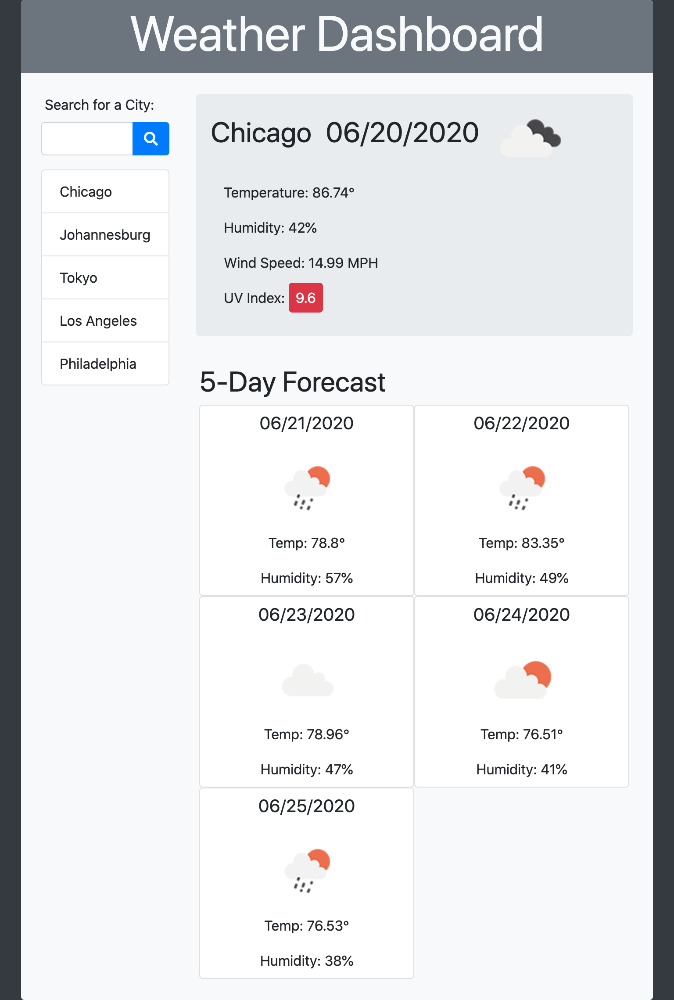

# WeatherDashboard
* [Deployed Site](https://segh.github.io/WeatherDashboard)
* [My GitHub](https://github.com/SEGH)

## Description
This is an application with the purpose of allowing a user to easily search for weather around the world. It runs in the browser and stores the user's search input in local storage, allowing them to view their search history and view their most recently searched city's weather displayed immediately upon returning to the page. It uses the OpenWeather API to return both current weather data and a five day forecast.

## Usage
* When the user first visits the dashboard they are presented with a prepopulated list of suggested cities in the search list.
* The city at the top of the list has weather data displayed at the right of the dashboard.
* When the user uses the input to search for a city, that city is added to the top of the search history list and its weather data is displayed in the dashboard.
* The user can click on any city in the list, and that city's weather will be displayed.
* When the page is refreshed, the user's previous searches persist in the search history list and their most recently viewed city's weather is displayed in the dashboard.

## Examples of responsive interface

### 375px

------

### 768px

------

### 1200px

------